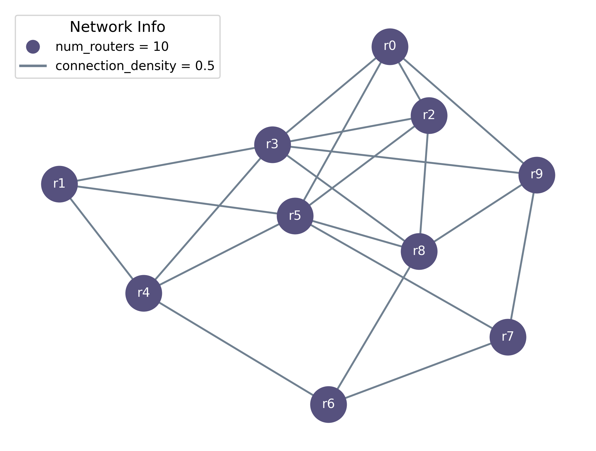

<p align=center>  

## CongestRL
Reinforcement learning policies for congestion and delay control in a virtual network simulation environment with threading. Please refer to the [report](report.pdf) for extensive analysis and results.

**Dependencies:** Python 3.12<br>
**Contact:** Aimilia Palaska (aimilia.p2@gmail.com)<br>
**License:** Apache 2.0

## ⚡Quickstart

Clone this repository with `git clone https://github.com/emily-palaska/LlmBlockMerger-Diploma`<br>
Install requirements with `pip install -r requirements.txt`<br>

### Example of DQN Agent
```python
from congestrl.policy.dqn_agent import DQNAgent
from congestrl.simulation.environment import CongestControlEnv
from congestrl.core.results import ResultManager
from datetime import datetime

episodes, steps = 10, 200
r, u = 10, 50
step_time = 5
congestion_limit = 8000
batch = 8

env = CongestControlEnv(r, u, limit=congestion_limit, step_time=step_time)
state_size = env.observation_space.shape[0]
agent = DQNAgent(state_size, env.action_space, batch_size=batch)

timestamp = datetime.now().strftime("%m%d_%H%M")
filename = f'{timestamp}_dqn_e{episodes}_s{steps}.json'
manager = ResultManager(path='../../results/' ,filename=filename, metadata={**agent.metadata, **env.metadata})

for e in range(episodes):
    state, info = env.reset()
    manager.append_step(info=info)
    for step in range(steps):
        print(f"\rStep {step + 1}", end='')
        action = agent.get_action(state)
        next_state, reward, info = env.step(action)

        agent.remember(state, action, reward, next_state)
        agent.replay()

        manager.append_step(reward=reward, info=info)
        state = next_state

    manager.append_episode()
    print(f"\rEpisode {e+1} complete")

manager.save()
print(f'Results saved in {manager.full_path}')
env.stop()
```

### Example of PPO Agent
```python
from congestrl.policy.ppo_agent import PPOAgent
from congestrl.simulation.environment import CongestControlEnv
from congestrl.core.results import ResultManager
from datetime import datetime

episodes, steps = 10, 200
r, u = 10, 50
step_time = 5
congestion_limit = 8000

env = CongestControlEnv(r, u, limit=congestion_limit, step_time=step_time)
state_size = env.observation_space.shape[0]
agent = PPOAgent(state_size, env.action_space)

timestamp = datetime.now().strftime("%m%d_%H%M")
filename = f'{timestamp}_ppo_e{episodes}_s{steps}.json'
manager = ResultManager(filename=filename, metadata={**agent.metadata, **env.metadata})

for e in range(episodes):
    state, info = env.reset()
    manager.append_step(info=info)

    for step in range(steps):
        print(f"\rStep {step + 1}", end='')
        action, log_prob = agent.get_action(state)
        next_state, reward, info = env.step(action)

        agent.remember(state, action, reward, next_state, log_prob)
        manager.append_step(reward=reward, info=info)
        state = next_state

    agent.update()
    manager.append_episode()
    print(f"\rEpisode {e+1} complete")

manager.save()
print(f'Results saved in {manager.full_path}')
env.stop()
```


## 🧠About
This project was made for the Computational Intelligence & Deep Reinforcement Learning course of ECE AuTH.
As part of it, a parrelizable virtual netwrok consisting of routers that exchange packets was implemented.
The goal is to maintain congestion, meaning the amount of packets on flight, below a congestion limit while also
keeping the delay times of packets as low as possible. For this, a baseline Rnadom policy was implemented, along with
a DQN and PPO agent, with 3 different reward functions for testing.

The CongestNetwork is represented as a connected, undirected graph G(R,E), where R denotes routers (nodes) and E the weighted connections (edges).
The topology follows a non-deterministic initialization, which aims to avoid overtaining the neural networks on a specific dynamic.
<p align=center>   

The packet structure includes dummy information to simulate information exchange.
The metrics used in this environment are the 2.5s of congestion samples (sum of edges' weights) and the average delay time per router (last 1000 packets).
<p align=center>  

The metrics create the Observation and Action vector spaces, which map the environment for agents to learn upon. Each step runs the network for `step_time=5` seconds and freezes it,
employing Events from the Threading library.
<p align=center> 

Reward function implemented include linear, quadratic and exponential approaches. Non-linearity is explored in terms of network convergence and send rate stabilization.
<p align=center> 
  
  
   

## 🌐Results
Agents are trained to modify the routers' send rates in order to keep congestion below the `congestion_limit` while keeping delay as low as possible as the network topology allows. 
Reinforcement learning policies managed to stabilize send rates, favoring routers in more connected positions.
<p align=center> 
<p align=center>   
    
Furthermore, as the agents trained, the congestion showed less spikes, showing that the structures learned to decrease the send rates.
<p align=center> 

Lastly, a sweep of the parameter a, ie the weight of the delay times in the reward functions, showed that CongestRL provides flexivility to different network goals.
<p align=center> 

